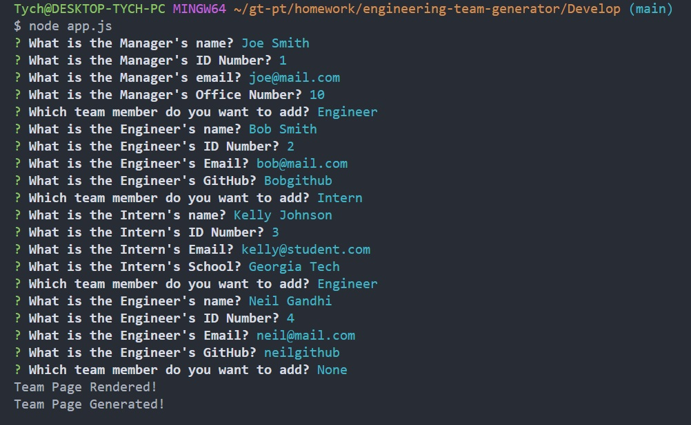
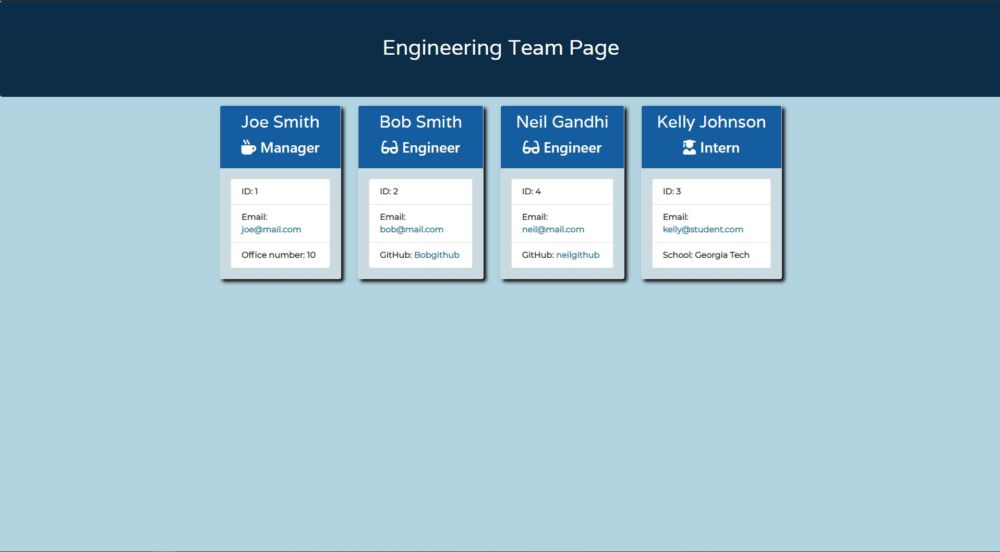

# Engineering Team Generator

## Description

This is a NODE CLI application for building a software engineering team. The application utilizes NPM Inquirer to prompt users for various inputs to build a team consisting of a 'Manager', and any number/combinations of 'Engineers' and 'Interns'. Users can input the employee names, IDs, email addresses and role specific criteria such as office numbers (Manager), github account (Engineer), and school (Intern).

Once the user is finished with creating the team via the prompts, the application will create a team webpage that can be viewed in the browser, with each team member's information.

## Table of Contents

- [Description](#description)
- [User Story](#user-story)
- [Application Screenshot](#application-screenshot)
- [Installation](#installation)
- [Usage](#usage)
- [Credits](#credits)

## User Story

```
As a manager
I want to generate a webpage that displays my team's basic info
so that I have quick access to emails and GitHub profiles
```

## Application Images



_Sample screenshot of the team prompt questions and the user responses._



_Sample screenshot of the Engineering Team Page generated with the user inputs_

## Installation

This application requires the use of Node.js and Inquirer. To install this application, clone the project files from the [GitHub Repository](https://github.com/ntch2000/engineering-team-generator) and ensure you have Node.js installed. Terminal into the project and 'Develop' directory and run the following command.

```node.js
npm install
```

This will install the required dependencies, including Inquirer and the application will be ready to run.

## Usage

To run the application, open a terminal and cd into the project and then into 'Develop/' directories. Once in the directory run the following command.

```node.js
node app.js
```

This will start the prompts to create an engineering team. Go through and answer each prompt and add as many team members as desired. Once the last team member prompt is answered, a 'team.html' file will be created in the 'output/' directory. This file can be opened in any browser to display the team webpage.

A video of this can be found at the following link [Engineering Team Generator Walkthrough Video](https://drive.google.com/file/d/1xKqhLXCecNWQMGbXBP_bN95fOpe5IZvo/view?usp=sharing).

## Credits

Utilized NPM Inquirer which can be found at [Inquirer](https://www.npmjs.com/package/inquirer). Inquirer allows for prompts to be displayed to the command line and responses to be output as an object in JavaScript.

---

© 2020 Neil Gandhi
